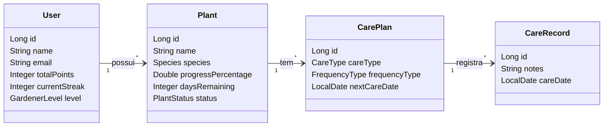

# Arquitetura e Documentação Técnica — Grevia API

Visão geral atualizada das decisões arquiteturais, tecnologias, módulos e padrões de segurança do backend Grevia. Esta documentação serve como o guia principal para a integração do frontend e entendimento do sistema.

---

## 🚀 Stack Tecnológica

| Categoria | Tecnologia | Versão |
|---|---|---|
| Linguagem | Java (OpenJDK Temurin) | 21 |
| Framework | Spring Boot | 3.5.11 |
| Persistência | Spring Data JPA + Hibernate | — |
| Banco de Dados | MySQL | 8.0 |
| Segurança | Spring Security + JJWT | 0.12.3 |
| Mapeamento (DTOs) | MapStruct + Lombok | 1.5.5 |
| Rate Limiting | Bucket4j | 8.10.1 |
| Documentação da API | Springdoc OpenAPI (Swagger UI) | 2.8.15 |
| E-mail Transacional | Spring Mail (JavaMailSender / Gmail SMTP) | — |
| Observabilidade | Spring Actuator | — |
| Containerização | Docker (Multi-Stage Build) | — |

---

## 🗂️ Estrutura do Projeto (Domínios)

A API segue uma arquitetura de **Monólito Modular** organizada por domínios de negócio. Cada domínio tem seu ciclo de vida completo (Controller, Service, Repository, DTO, Mapper).

```
com.projeto1cc.grevia/
├── core/                               ← Infraestrutura transversal
│   ├── auth/                           ← Autenticação e autorização
│   ├── config/                         ← Configurações globais (Security, JWT, Swagger)
│   ├── security/                       ← Proteção (Rate Limiting, Admin Seeder)
│   ├── service/                        ← Serviços compartilhados (Email)
│   └── feedback/                       ← Gestão de feedback do aplicativo
├── plant/                              ← Domínio de Plantas
│   ├── service/                        ← PlantService, RecommendationService
│   ├── mapper/                         ← PlantMapper (inclui cálculo de progresso)
│   └── enums/                          ← Species (70+), SoilType, PlantUtility
├── care/                               ← Domínio de Cuidados
│   ├── service/                        ← CarePlanService, CareRecordService, SpeciesCareService
│   └── enums/                          ← CareType, FrequencyType
└── user/                               ← Domínio de Usuários
    ├── service/                        ← UserService (perfil, promoção, senha)
    └── mapper/                         ← UserMapper (inclui lógica de nível/rank)
```

### Princípios da Arquitetura

| Princípio | Como é aplicado |
|---|---|
| **Separação de responsabilidades** | Controllers (entrada), Services (lógica), Repositories (persistência). |
| **DTOs como contrato de API** | Nenhuma entidade JPA é exposta diretamente; MapStruct faz a conversão. |
| **Stateless** | Sem sessões no servidor; cada requisição é autenticada via JWT. |
| **Domínios isolados** | Módulos `plant`, `care`, `user` são organizados de forma independente. |

---

## 🔄 Fluxo de Negócio e Gamificação

### 1. Ciclo de Vida da Planta
- **Criação**: Ao registrar uma planta, planos de cuidado são gerados automaticamente baseados na espécie.
- **Progresso**: Calculado em tempo real no `PlantMapper` baseado na data de registro e dias para maturidade da espécie.
- **Ações**: Colheita (`/harvest`) e Arquivamento (`/archive`) permitem gerenciar o estado da planta.
- **Histórico**: Plantas arquivadas são listadas em `/api/plants/history`.

### 2. Gamificação e Níveis (Rank System)
- **Pontos**: Ganhos ao completar cuidados. Bônus por pontualidade e streaks.
- **Streaks**: Incrementado ao realizar cuidados em dias consecutivos.
- **Níveis (GardenerLevel)**: O usuário evolui de "Iniciante" até "Mestre Botânico" conforme acumula pontos. O nível é calculado dinamicamente no `UserMapper`.

| Nível | Título | Pontos |
|---|---|---|
| 1 | Jardineiro Iniciante | 0 |
| 2 | Jardineiro Aprendiz | 50 |
| 3 | Jardineiro Dedicado | 200 |
| 4 | Mestre Botânico | 500 |

---

## 🔒 Segurança

### 1. Autenticação e Autorização
- **JWT (JSON Web Token)**: Autenticação via header `Authorization: Bearer <TOKEN>`.
- **RBAC (Role-Based Access Control)**: Roles `USER` e `ADMIN`. Algumas rotas (como promoção de usuário) exigem `ADMIN`.
- **Isolamento de Dados**: Validação rigorosa para garantir que um usuário só acesse suas próprias plantas e planos.

### 2. Rate Limiting (Bucket4j)
Buckets independentes **por IP** para prevenir abusos:
- **Auth Routes**: 10 req / 15 min (Proteção contra brute force).
- **General Routes**: 60 req/min e 500 req/hora.

### 3. Recuperação de Senha
Processo via e-mail com token UUID temporário (TTL de 1 hora) e proteção contra *user enumeration*.

---

## 📊 Diagrama de Entidades



---

## 📈 Observabilidade e Infraestrutura

- **Spring Actuator**: Monitoramento via `/actuator/health`, `/actuator/metrics`.
- **Docker**: Build multi-stage gerando imagens otimizadas para produção.
- **Admin Seeder**: Garante a existência de um administrador padrão no primeiro boot.
