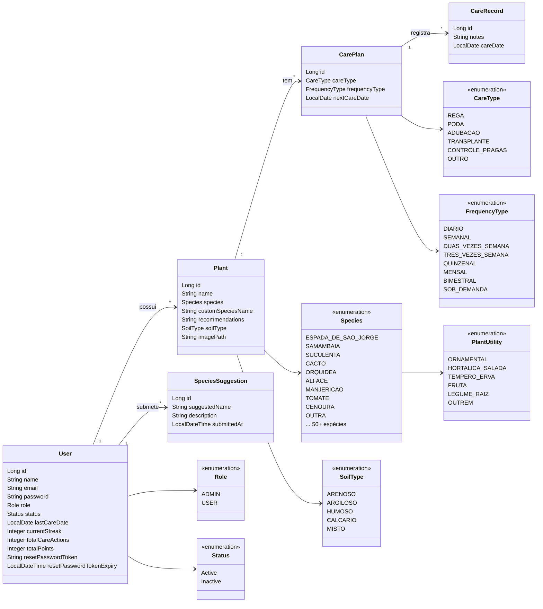
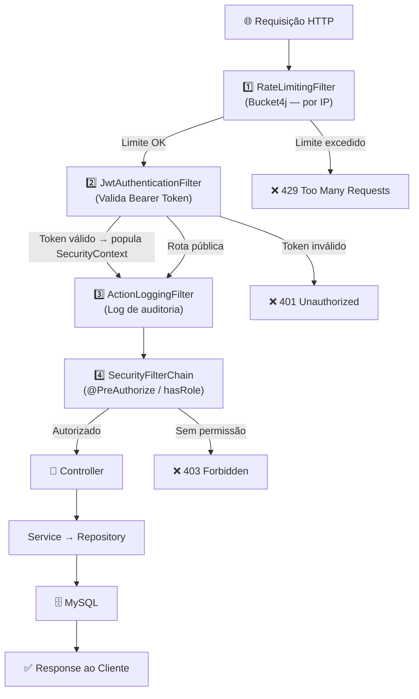
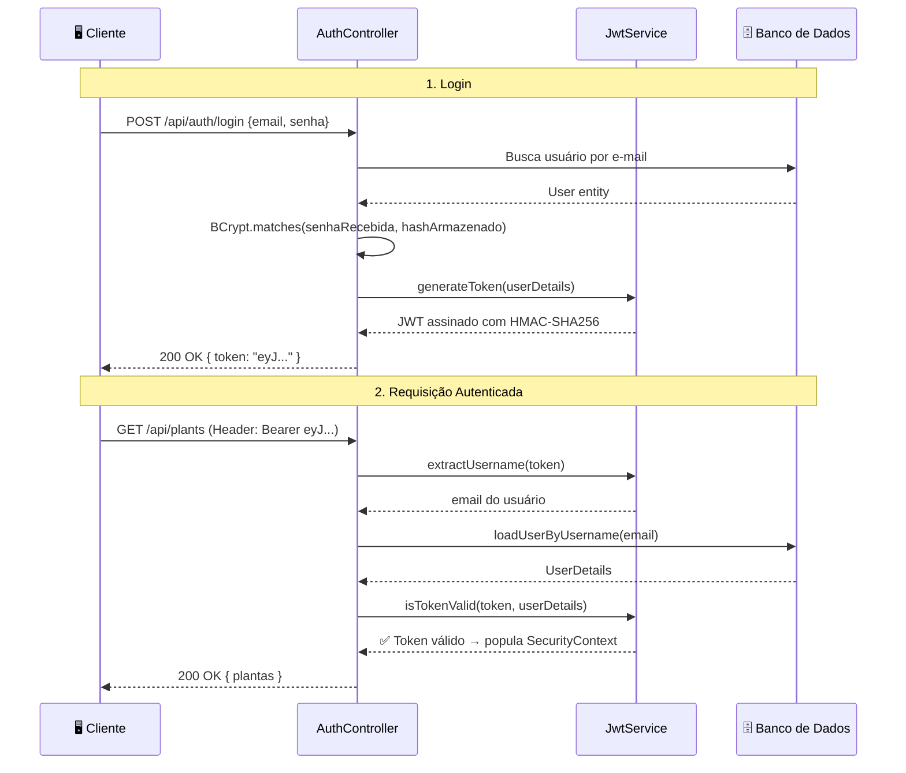
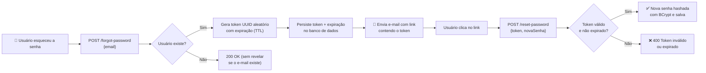

# Arquitetura e Documentação Técnica — Grevia API

Visão geral das decisões arquiteturais, tecnologias, módulos e padrões de segurança do backend.

---

## 🚀 Stack Tecnológica

| Categoria | Tecnologia | Versão |
|---|---|---|
| Linguagem | Java (OpenJDK Temurin) | 21 |
| Framework | Spring Boot | 3.5.11 |
| Persistência | Spring Data JPA + Hibernate | — |
| Banco de Dados | MySQL | 8.0 |
| Segurança | Spring Security + JJWT | 0.12.3 |
| Mapeamento (DTOs) | MapStruct + Lombok | 1.5.5 |
| Rate Limiting | Bucket4j | 8.10.1 |
| Documentação da API | Springdoc OpenAPI (Swagger UI) | 2.8.15 |
| Upload de Imagens | Cloudinary Java SDK | 1.36.0 |
| E-mail Transacional | Spring Mail (JavaMailSender / Gmail SMTP) | — |
| Observabilidade | Spring Actuator | — |
| Containerização | Docker (Multi-Stage Build) | — |

---

## 🗂️ Estrutura do Projeto

A API segue uma arquitetura de **Monólito Modular** organizada por domínios de negócio. Cada domínio é autossuficiente (controller, service, repository, model, dto, mapper e enums próprios), comunicando-se apenas através de interfaces de serviço.

```
com.projeto1cc.grevia/
│
├── GreviaApplication.java              ← Ponto de entrada Spring Boot
│
├── core/                               ← Infraestrutura transversal (sem lógica de negócio)
│   ├── auth/                           ← Autenticação e autorização
│   │   ├── controller/                 ← AuthRestController (register, login, forgot/reset password)
│   │   ├── dto/                        ← DTOs de requisição e resposta de autenticação
│   │   └── service/                    ← JwtService (geração e validação de tokens JWT)
│   │
│   ├── config/                         ← Configurações globais do Spring Security
│   │   ├── SecurityConfig.java         ← Cadeia de filtros, CORS, BCrypt, sessão stateless
│   │   ├── JwtAuthenticationFilter.java ← Extrai e valida o token JWT a cada requisição
│   │   ├── ActionLoggingFilter.java    ← Log de todas as ações HTTP (método, rota, status)
│   │   ├── CloudinaryConfig.java       ← Bean de configuração do Cloudinary SDK
│   │   └── SpringDocConfig.java        ← Configuração do Swagger UI com suporte a Bearer Token
│   │
│   ├── security/                       ← Proteção contra abusos
│   │   ├── RateLimitingFilter.java     ← Rate limiting por IP com Bucket4j (Token Bucket)
│   │   └── AdminSeeder.java            ← Seed automático do usuário ADMIN na inicialização
│   │
│   └── service/                        ← Serviços de infraestrutura compartilhados
│       ├── CloudinaryService.java      ← Upload de imagens para o Cloudinary
│       └── EmailService.java           ← Envio de e-mails transacionais via Spring Mail
│
├── plant/                              ← Domínio de Plantas
│   ├── controller/                     ← PlantRestController, SpeciesSuggestionRestController
│   ├── service/                        ← PlantService, PlantRecommendationService, SpeciesSuggestionService
│   ├── repository/                     ← PlantRepository, SpeciesSuggestionRepository
│   ├── model/                          ← Plant, SpeciesSuggestion (entidades JPA)
│   ├── dto/                            ← DTOs de entrada e saída
│   ├── mapper/                         ← PlantMapper, SpeciesSuggestionMapper (MapStruct)
│   └── enums/                          ← Species, SoilType, PlantUtility
│
├── care/                               ← Domínio de Cuidados
│   ├── controller/                     ← CarePlanRestController, CareRecordRestController
│   ├── service/                        ← CarePlanService, CareRecordService, SpeciesCareService
│   ├── repository/                     ← CarePlanRepository, CareRecordRepository
│   ├── model/                          ← CarePlan, CareRecord (entidades JPA)
│   ├── dto/                            ← DTOs de entrada e saída
│   ├── mapper/                         ← CarePlanMapper, CareRecordMapper (MapStruct)
│   └── enums/                          ← CareType, FrequencyType
│
└── user/                               ← Domínio de Usuários
    ├── controller/                     ← UserRestController (/me, promoção de roles)
    ├── service/                        ← UserService (criação, recuperação de senha, promoção)
    ├── repository/                     ← UserRepository
    ├── model/                          ← User (entidade JPA)
    ├── dto/                            ← DTOs de perfil e atualização
    └── mapper/                         ← UserMapper (MapStruct)
```

### Princípios da Arquitetura

| Princípio | Como é aplicado |
|---|---|
| **Separação de responsabilidades** | Controllers recebem a requisição, Services executam a lógica, Repositories persistem os dados |
| **DTOs como contrato de API** | Nenhuma entidade JPA é exposta diretamente; MapStruct converte automaticamente |
| **Stateless** | Sem sessões no servidor; cada requisição é autenticada via JWT |
| **Domínios isolados** | Cada módulo (`plant`, `care`, `user`) tem seus próprios pacotes e não depende diretamente de outros |
| **Core como infraestrutura** | Tudo que é transversal (segurança, e-mail, upload) fica em `core/`, sem lógica de negócio |

---

## 🏗️ Módulos do Sistema

### 1. Core — Infraestrutura Compartilhada (`core/`)

Tudo que é **transversal** ao domínio fica aqui:

| Pacote | Responsabilidade | Principais Classes |
|---|---|---|
| `core.auth` | Autenticação e autorização | `AuthRestController`, `JwtService`, DTOs de login/registro/forgot-password |
| `core.config` | Configs globais do Spring | `SecurityConfig`, `CloudinaryConfig`, `SpringDocConfig`, `JwtAuthenticationFilter`, `ActionLoggingFilter` |
| `core.security` | Proteção contra abuso | `RateLimitingFilter` (Bucket4j), `AdminSeeder` |
| `core.service` | Serviços de infraestrutura | `CloudinaryService` (upload de imagens), `EmailService` (envio de e-mails) |

### 2. Plant — Domínio de Plantas (`plant/`)

Gerencia o **catálogo de plantas**, **recomendações inteligentes** e **sugestões da comunidade**.

| Componente | Descrição |
|---|---|
| `PlantRestController` | CRUD completo de plantas + feed comunitário + upload de imagens |
| `SpeciesSuggestionRestController` | Endpoint para submissão e listagem de sugestões de novas espécies |
| `PlantService` | Lógica de negócio de plantas (criação, atualização, deleção, validações de posse) |
| `PlantRecommendationService` | Motor de recomendação baseado em tipo de terreno + tipo de planta (50+ espécies catalogadas) |
| `SpeciesSuggestionService` | Gestão de sugestões de espécies feitas pela comunidade |

### 3. Care — Domínio de Cuidados (`care/`)

Gerencia **planos de cuidado** e o **histórico de registros de manutenção** das plantas.

| Componente | Descrição |
|---|---|
| `CarePlanRestController` | CRUD de planos de cuidado vinculados a uma planta |
| `CareRecordRestController` | Criação e listagem de registros de cuidados realizados |
| `CarePlanService` | Lógica de criação e atualização de planos de cuidado |
| `CareRecordService` | Lógica de registros de cuidados (rega, poda, etc.) |
| `SpeciesCareService` | Definição de métricas padrão por espécie (frequência de rega, cuidados default) |

### 4. User — Domínio de Usuários (`user/`)

Gerencia o **perfil**, **desativação de conta** e **promoção de roles**.

| Componente | Descrição |
|---|---|
| `UserRestController` | Perfil do usuário (`/me`), atualização, desativação e promoção a Admin |
| `UserService` | Lógica de negócio de usuários, incluindo criação, recuperação de senha e promoção |

---

## 📊 Diagrama de Classes (Entidades JPA)



---

## 🔒 Segurança

A segurança da API é implementada em **múltiplas camadas independentes**, garantindo defesa em profundidade: limitação de requisições → autenticação → autorização → controle de acesso ao recurso.

### Camadas de Segurança



---

### 1. Autenticação — JWT (JJWT 0.12.3)

O sistema é **completamente stateless**: nenhuma sessão é armazenada no servidor. A identidade do usuário viaja em cada requisição através de um **JSON Web Token**.

**Configuração de sessão (`SecurityConfig.java`):**
```java
.sessionManagement(session -> session.sessionCreationPolicy(SessionCreationPolicy.STATELESS))
```

**Fluxo de Login:**



**Detalhes técnicos do JWT:**
- **Algoritmo de assinatura:** HMAC-SHA256 (HS256) com chave secreta configurada via variável de ambiente
- **Claims:** contém o `username` (e-mail) do usuário
- **Validação (`JwtAuthenticationFilter`):** extrai o token do header `Authorization: Bearer <token>`, valida assinatura e expiração, e popula o `SecurityContextHolder`
- **Sem renovação automática:** o cliente deve fazer novo login ao expirar

---

### 2. Hashing de Senhas — BCrypt

Senhas **nunca são armazenadas em texto puro**. O `BCryptPasswordEncoder` é configurado como bean global:

```java
@Bean
public PasswordEncoder passwordEncoder() {
    return new BCryptPasswordEncoder();
}
```

- **Fator de custo:** padrão do Spring (10 rounds), resistente a força bruta
- **Salt automático:** cada hash é único mesmo para senhas idênticas
- **Comparação segura:** `BCrypt.matches()` é usado pelo `DaoAuthenticationProvider`

---

### 3. Autorização — RBAC (Role-Based Access Control)

O sistema possui dois papéis (`Role`): `USER` e `ADMIN`. O controle de acesso é aplicado em dois níveis:

**Nível de rota (`SecurityConfig.java`):**
```java
.authorizeHttpRequests(authorize -> authorize
    .requestMatchers("/api/auth/**").permitAll()    // rotas públicas
    .requestMatchers("/error").permitAll()
    .requestMatchers(SWAGGER_WHITELIST).permitAll()
    .anyRequest().authenticated()                   // todo o resto exige autenticação
)
```

**Nível de método (`@EnableMethodSecurity`):**
- `@PreAuthorize("hasRole('ADMIN')")` em endpoints sensíveis (ex: `PATCH /api/users/{id}/promote`)
- Garante que mesmo um usuário autenticado não acesse recursos fora do seu papel

**Isolamento por proprietário (nível de serviço):**
- Cada operação de Plant/CarePlan/CareRecord valida que o recurso pertence ao usuário autenticado
- Usuários não conseguem acessar dados de outros usuários mesmo com token válido

---

### 4. Rate Limiting — Bucket4j (Token Bucket)

O `RateLimitingFilter` aplica o algoritmo **Token Bucket** com buckets independentes **por IP**, com regras diferenciadas por tipo de rota:

| Rota | Política | Justificativa |
|---|---|---|
| `/api/auth/**` | 10 req / 15 minutos | Proteção contra força bruta e credential stuffing |
| Demais rotas | 60 req/min **E** 500 req/hora | Proteção contra burst e DDoS lento (dois tokens, duas camadas) |

**Comportamento especial:** após login bem-sucedido (`200 OK`), o bucket de autenticação do IP é **resetado**, permitindo que usuários legítimos tentem novamente sem penalidade.

**Extração de IP com suporte a proxy:**
```java
private String getClientIp(HttpServletRequest request) {
    String xForwardedFor = request.getHeader("X-Forwarded-For");
    if (xForwardedFor != null && !xForwardedFor.isBlank()) {
        return xForwardedFor.split(",")[0].trim(); // primeiro IP da cadeia de proxies
    }
    return request.getRemoteAddr();
}
```

---

### 5. Recuperação de Senha — Token Temporário



> **Nota de segurança:** quando o e-mail não é encontrado, a API retorna `200 OK` sem mensagem de erro — isso previne **user enumeration** (descoberta de quais e-mails estão cadastrados).

---

### 6. CORS — Cross-Origin Resource Sharing

Configurado explicitamente no `SecurityConfig` para aceitar apenas origens conhecidas:

```java
configuration.setAllowedOrigins(List.of(
    "http://localhost:5173",   // Vite dev server
    "http://localhost:3000",   // alternativo
    "https://grevia-app.vercel.app"  // frontend em produção
));
configuration.setAllowedMethods(List.of("GET", "POST", "PUT", "DELETE", "OPTIONS", "PATCH"));
configuration.setAllowCredentials(true);
```

---

### 7. Auditoria — ActionLoggingFilter

Todas as requisições são registradas no log da aplicação após processamento, incluindo: método HTTP, URI, IP do cliente e status de resposta. Útil para auditoria e debugging em produção.

---

### Resumo das Camadas de Proteção

| Camada | Mecanismo | Classe |
|---|---|---|
| Limitação de tráfego | Token Bucket por IP | `RateLimitingFilter` |
| Autenticação | JWT Bearer Token (HMAC-SHA256) | `JwtAuthenticationFilter` + `JwtService` |
| Hashing de senha | BCrypt (10 rounds) | `SecurityConfig.passwordEncoder()` |
| Autorização por papel | RBAC + `@PreAuthorize` | `SecurityConfig` + `@EnableMethodSecurity` |
| Isolamento de dados | Validação de posse no Service | `PlantService`, `CarePlanService`, etc. |
| Recuperação de senha | Token temporário com TTL | `UserService` + `EmailService` |
| CORS | Whitelist de origens | `SecurityConfig.corsConfigurationSource()` |
| Auditoria | Log estruturado de requisições | `ActionLoggingFilter` |

---

## 📸 Upload de Imagens (Cloudinary)

O serviço `CloudinaryService` gerencia o upload de imagens para o Cloudinary:
- Endpoint: `POST /api/plants/{id}/image` (multipart/form-data)
- Limite de arquivo: 5 MB
- A URL da imagem é salva na entidade Plant e retornada no DTO de resposta.

---

## 📧 Serviço de E-mail

O `EmailService` utiliza **Spring Mail** (`JavaMailSender`) com Gmail SMTP para envio de e-mails transacionais:
- Recuperação de senha (envio do token de reset)
- Remetente: `contactgrevia@gmail.com`
- Configurado via `spring.mail.*` nas variáveis de ambiente (sem credenciais hardcoded)

---

## 👤 Admin Seeder

O `AdminSeeder` (`ApplicationRunner`) verifica na inicialização se existe um usuário com role `ADMIN`. Caso não exista, cria automaticamente o usuário administrador padrão com credenciais definidas via variáveis de ambiente. Garante que a API sempre tenha um admin funcional sem necessidade de scripts SQL manuais.

---

## 📈 Observabilidade (Actuator)

Endpoints expostos:
- `GET /actuator/health` — Status da aplicação (com detalhes)
- `GET /actuator/info` — Informações da aplicação
- `GET /actuator/metrics` — Métricas de performance

---

## 🐳 Infraestrutura Docker

| Arquivo | Uso |
|---|---|
| `Dockerfile` | Build multi-stage (Maven build → JRE Alpine runtime) |
| `docker-compose.yml` | Ambiente de desenvolvimento (MySQL + API) |
| `docker-compose.prod.yml` | Ambiente de produção (com variáveis via `.env`) |

O Dockerfile usa **multi-stage build** para criar uma imagem final enxuta (~150MB) sem o Maven instalado.
