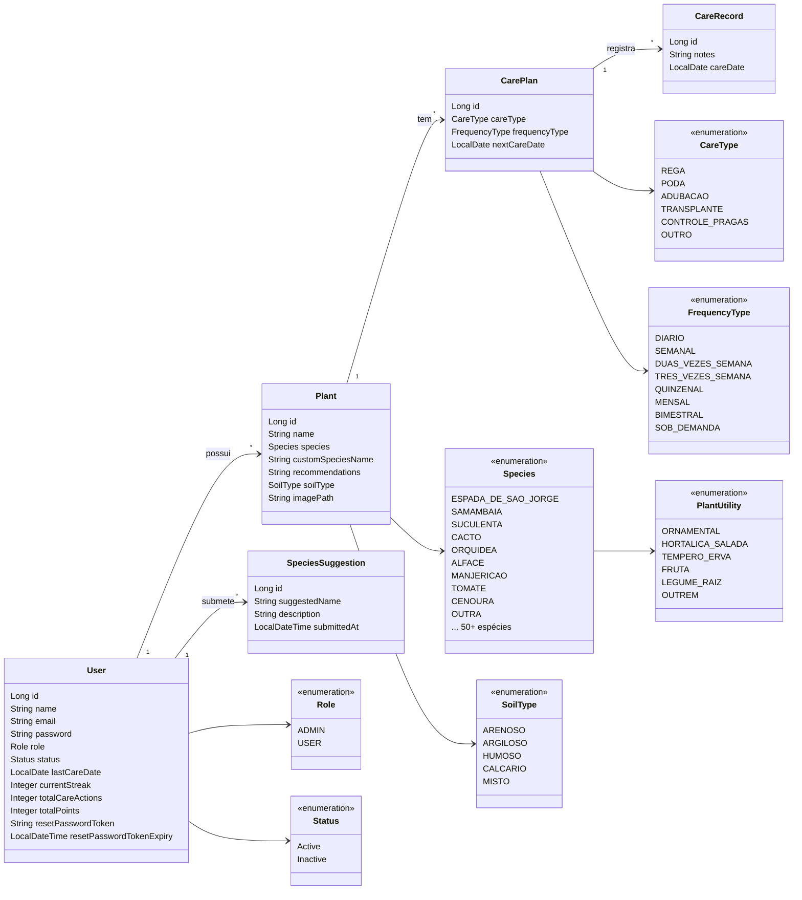
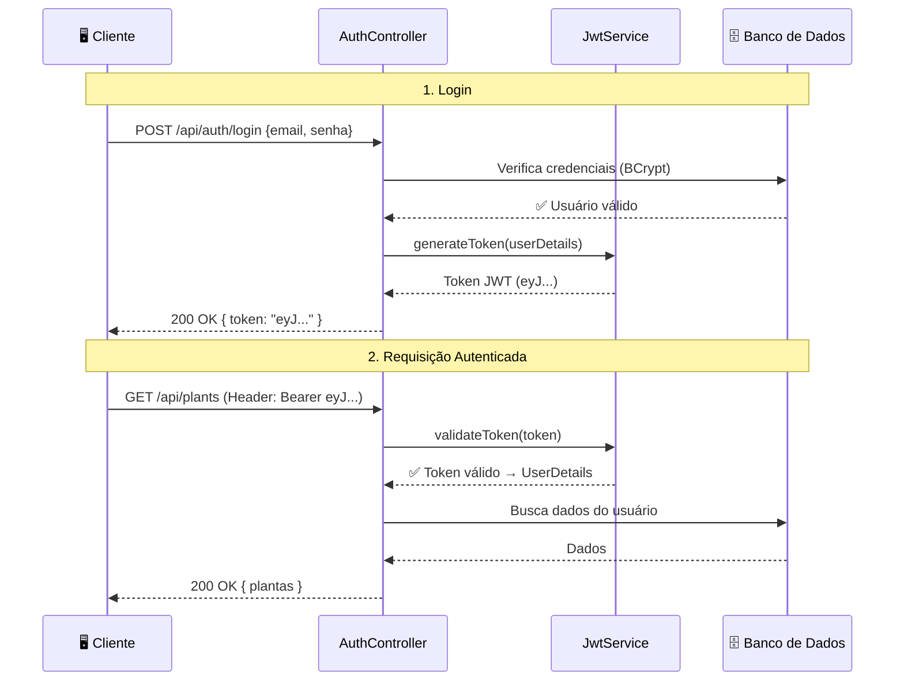
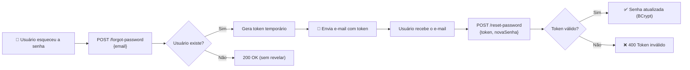
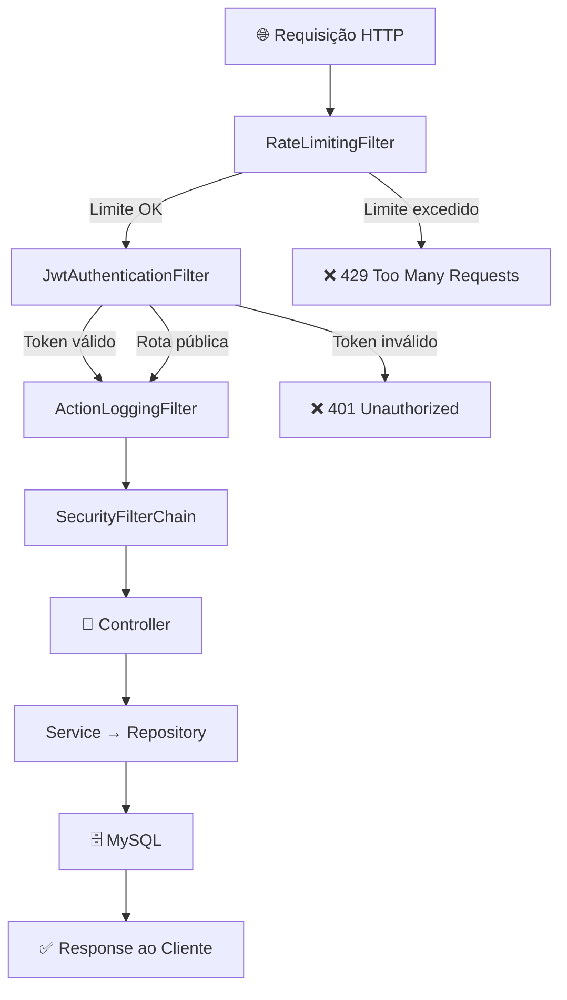

# Arquitetura e Documentação Técnica — Grevia API

Visão geral das decisões arquiteturais, tecnologias, módulos e padrões de segurança do backend.

---

## 🚀 Stack Tecnológica

| Categoria | Tecnologia | Versão |
|---|---|---|
| Linguagem | Java (OpenJDK Temurin) | 21 |
| Framework | Spring Boot | 3.5.11 |
| Persistência | Spring Data JPA + Hibernate | — |
| Banco de Dados | MySQL | 8.0 |
| Segurança | Spring Security + JJWT | 0.12.3 |
| Mapeamento (DTOs) | MapStruct + Lombok | 1.5.5 |
| Rate Limiting | Bucket4j | 8.10.1 |
| Documentação da API | Springdoc OpenAPI (Swagger UI) | 2.8.15 |
| Upload de Imagens | Cloudinary Java SDK | 1.36.0 |
| E-mail Transacional | Spring Mail + Resend Java SDK | 3.1.0 |
| Observabilidade | Spring Actuator | — |
| Containerização | Docker (Multi-Stage Build) | — |

---

## 🏗️ Módulos do Sistema

### 1. Core — Infraestrutura Compartilhada (`core/`)

Tudo que é **transversal** ao domínio fica aqui:

| Pacote | Responsabilidade | Principais Classes |
|---|---|---|
| `core.auth` | Autenticação e autorização | `AuthRestController`, `JwtService`, DTOs de login/registro/forgot-password |
| `core.config` | Configs globais do Spring | `SecurityConfig`, `CloudinaryConfig`, `SpringDocConfig`, `JwtAuthenticationFilter`, `ActionLoggingFilter` |
| `core.security` | Proteção contra abuso | `RateLimitingFilter` (Bucket4j) |
| `core.service` | Serviços de infraestrutura | `CloudinaryService` (upload de imagens), `EmailService` (envio de e-mails) |

### 2. Plant — Domínio de Plantas (`plant/`)

Gerencia o **catálogo de plantas**, **recomendações inteligentes** e **sugestões da comunidade**.

| Componente | Descrição |
|---|---|
| `PlantRestController` | CRUD completo de plantas + feed comunitário + upload de imagens |
| `SpeciesSuggestionRestController` | Endpoint para submissão e listagem de sugestões de novas espécies |
| `PlantService` | Lógica de negócio de plantas (criação, atualização, deleção, validações de posse) |
| `PlantRecommendationService` | Motor de recomendação baseado em tipo de terreno + tipo de planta (50+ espécies catalogadas) |
| `SpeciesSuggestionService` | Gestão de sugestões de espécies feitas pela comunidade |

### 3. Care — Domínio de Cuidados (`care/`)

Gerencia **planos de cuidado** e o **histórico de registros de manutenção** das plantas.

| Componente | Descrição |
|---|---|
| `CarePlanRestController` | CRUD de planos de cuidado vinculados a uma planta |
| `CareRecordRestController` | Criação e listagem de registros de cuidados realizados |
| `CarePlanService` | Lógica de criação e atualização de planos de cuidado |
| `CareRecordService` | Lógica de registros de cuidados (rega, poda, etc.) |
| `SpeciesCareService` | Definição de métricas padrão por espécie (frequência de rega, cuidados default) |

### 4. User — Domínio de Usuários (`user/`)

Gerencia o **perfil**, **desativação de conta** e **promoção de roles**.

| Componente | Descrição |
|---|---|
| `UserRestController` | Perfil do usuário (`/me`), atualização, desativação e promoção a Admin |
| `UserService` | Lógica de negócio de usuários, incluindo criação, recuperação de senha e promoção |

---

## 📊 Diagrama de Classes (Entidades JPA)

---

## 🔒 Segurança

### Fluxo de Autenticação (JWT)

1. O usuário se autentica via e-mail + senha (senha armazenada com hashing seguro via BCrypt).
2. Um token JWT é gerado com Claims contendo o ID do usuário.
3. Rotas protegidas validam o header `Authorization: Bearer <token>` a cada requisição.

### Fluxo de Recuperação de Senha

### Ciclo de Vida de uma Requisição HTTP (Filtros)

### Rate Limiting (Bucket4j)

O `RateLimitingFilter` aplica o algoritmo de Token Bucket para:
- Proteger contra ataques DDoS.
- Limitar tentativas de força bruta em rotas de login/registro.
- Garantir uso sustentável em ambientes compartilhados.

---

## 📸 Upload de Imagens (Cloudinary)

O serviço `CloudinaryService` gerencia o upload de imagens para o Cloudinary:
- Endpoint: `POST /api/plants/{id}/image` (multipart/form-data)
- Limite de arquivo: 5 MB
- A URL da imagem é salva na entidade Plant e retornada no DTO de resposta.

---

## 📧 Serviço de E-mail

O `EmailService` utiliza o **Resend SDK** para envio de e-mails transacionais:
- Recuperação de senha (envio do token de reset)
- Remetente: `contactgrevia@gmail.com`

---

## 📈 Observabilidade (Actuator)

Endpoints expostos:
- `GET /actuator/health` — Status da aplicação (com detalhes)
- `GET /actuator/info` — Informações da aplicação
- `GET /actuator/metrics` — Métricas de performance

---

## 🐳 Infraestrutura Docker

| Arquivo | Uso |
|---|---|
| `Dockerfile` | Build multi-stage (Maven build → JRE Alpine runtime) |
| `docker-compose.yml` | Ambiente de desenvolvimento (MySQL + API) |
| `docker-compose.prod.yml` | Ambiente de produção (com variáveis via `.env`) |

O Dockerfile usa **multi-stage build** para criar uma imagem final enxuta (~150MB) sem o Maven instalado.
