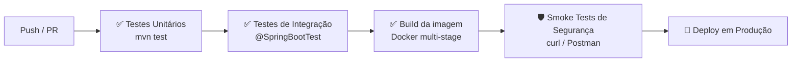

# Plano de Segurança e Testes — Grevia API (Produção)

> Documento focado no que precisa estar **feito e verificado antes de ir para produção**.  
> Separado em duas partes: **Segurança** (o que corrigir/configurar) e **Testes** (o que validar).

---

# PARTE 1 — Plano de Segurança para Produção

## 🚨 Diretrizes de Segurança Essenciais para Produção

Durante o desenvolvimento (ambiente dev), é comum utilizar configurações permissivas e segredos fixos (*hardcoded*) para facilitar os testes. No entanto, o ambiente de produção exige rigor extremo. As diretrizes abaixo listam os princípios arquiteturais e as práticas obrigatórias para implantação.

---

### 1. Gestão de Segredos e Credenciais

Em produção, o código-fonte deve ser limpo de qualquer credencial. 
- **Nunca fazer hardcode de chaves criptográficas:** Segredos sensíveis como o `SECRET_KEY` do JWT não devem residir em classes Java (`static final`). 
- **Evitar credenciais em properties provisionados no Git:** Configurações como senhas de SMTP do Spring Mail, ou API Keys, não devem possuir os valores reais de produção (ou app passwords) em campos padrão (`spring.mail.password=minha_senha`). 
- **Estratégia:** Injetar esses valores **exclusivamente via Variáveis de Ambiente (`.env`)** ou através de Secret Managers do provedor de Nuvem, os capturando através de `@Value("${nome.variavel}")`.

### 2. Configuração Básica e Isolamento (CORS)

- O CORS com Fallback ou Wildcard (`*`) é muito útil em Dev, mas inaceitável em Prod.
- **Estratégia:** Permitir *explicitamente* as origens de front-end conhecidas configurando métodos exatos através da whitelist do Spring Security. 

### 3. Durabilidade de Tokens e Tempo de Vida (TTL)

- Tokens que nunca expiram ou demoram demais (ex: múltiplos dias) não reagem bem à revogação.
- **Estratégia:** O Access Token JWT deve ser rápido e parametrizável, preferencialmente configurado através da properties para permitir ajustes de tempo em produção sem necessidade de recompilar e implantar o código. 

### 4. Proteção do Modelamento de Dados 

- Mecanismos ORM possuem opções drásticas para acelerar o desenvolvimento, como `spring.jpa.hibernate.ddl-auto=update`. Essa métrica é estritamente de Dev.
- **Estratégia:** O JPA/Hibernate em produção deve assumir o papel `validate` ou `none`. Qualquar mudança em coluna, tabelas e afins deverá ser aplicada através de versionamento explícito de scripts (como Flyway ou Liquibase), mitigando o risco de atualizações acidentais no banco corromperem dados por um `restart` automático.

### 5. Exposição e Vazamento de Respostas Técnicas

- Logs são essenciais mas muitas vezes ruidosos (Debug mode ligado para o Mail Server, ou stack traces completos enviados como resposta HTTP num code 500).
- **Estratégia:** Desabilitar verbose logging (ex: `mail.debug=false`). Todo o tráfego do Spring Actuator (que provê features de métricas como o `/health`) tem de ser limitado. Detalhes de infraestrutura expostos (`show-details=always`) fornecem mapas do serviço para agressores; portanto tem de ser configurado para o cenário autenticado (`when-authorized`).

---

## ✅ Checklist de Segurança para Go-Live

Use este checklist antes de qualquer deploy em produção:

### Credenciais e Segredos
- [ ] Chave JWT (`JWT_SECRET`) gerada com `openssl rand -base64 64` e configurada como variável de ambiente
- [ ] App Password do Gmail **revogado** e um novo criado, configurado apenas como env var
- [ ] `application.properties` **não contém** nenhum valor padrão de credencial (senhas, tokens, api keys)
- [ ] `.env` e `admin-config.properties` estão no `.gitignore` e **nunca commitados**

### Autenticação e Autorização
- [ ] Expiração do JWT está correta e configurável via env var
- [ ] `@PreAuthorize` está presente em todos os endpoints admin
- [ ] Todos os endpoints novos passaram por revisão de autorização (nenhum esquecido como público)

### CORS e Rede
- [ ] Wildcard de CORS (`allowedOriginPatterns("*")`) removido
- [ ] Apenas os domínios de produção estão na whitelist de CORS
- [ ] HTTPS forçado (via proxy reverso / Railway / Vercel — nunca HTTP em produção)

### Banco de Dados
- [ ] `ddl-auto=validate` ou `none` em produção
- [ ] Usuário do banco de dados tem apenas as permissões necessárias (sem `GRANT ALL`)
- [ ] Backup automático configurado no provedor

### Logs e Observabilidade
- [ ] `mail.debug=false` em produção
- [ ] Logs não imprimem senhas, tokens ou dados pessoais
- [ ] Actuator com `show-details=when-authorized`
- [ ] Logs de produção sendo coletados (Railway Logs, Datadog, Papertrail, etc.)

### Docker e Infraestrutura
- [ ] `docker-compose.prod.yml` usa apenas variáveis de ambiente (sem values hardcoded)
- [ ] Imagem Docker construída a partir da tag de release, não do `latest`
- [ ] Porta do banco de dados não exposta externamente (apenas comunicação interna Docker)

---

## 🔒 Configuração Recomendada das Variáveis de Ambiente (Produção)

```bash
# Banco de dados
MYSQLHOST=<host-interno>
MYSQLPORT=3306
MYSQLDATABASE=greviadb
MYSQLUSER=grevia_user
MYSQLPASSWORD=<senha-forte-gerada>

# JWT
JWT_SECRET=<openssl rand -base64 64>
JWT_EXPIRATION_MS=86400000

# E-mail
SPRING_MAIL_HOST=smtp.gmail.com
SPRING_MAIL_PORT=587
SPRING_MAIL_USERNAME=contactgrevia@gmail.com
SPRING_MAIL_PASSWORD=<nova-app-password>

# Comportamento em produção
DDL_AUTO=validate
MAIL_DEBUG=false
```

---

---

# PARTE 2 — Plano de Testes

## 🎯 Estratégia de Testes

A estratégia segue a **Pirâmide de Testes**: mais testes unitários (rápidos, baratos), menos de integração (lentos, caros), poucos manuais (passagem de fumaça antes do deploy).

```
        /\
       /  \   ← Testes Manuais / Exploratórios (pré-deploy)
      /----\
     /      \  ← Testes de Integração (endpoints reais)
    /--------\
   /          \ ← Testes Unitários (lógica isolada)
  /____________\
```

---

## 🧪 Testes Unitários

### JwtService

| # | Caso de Teste | Resultado Esperado |
|---|---|---|
| 1 | `generateToken()` retorna string não nula | Token JWT gerado |
| 2 | `extractUsername()` com token válido | Retorna o e-mail correto |
| 3 | `isTokenValid()` com token válido e user correto | `true` |
| 4 | `isTokenValid()` com token de outro usuário | `false` |
| 5 | `isTokenValid()` com token expirado | `false` |
| 6 | `extractUsername()` com token malformado | Lança `JwtException` |

```java
// Exemplo de teste — JwtServiceTest.java
@ExtendWith(MockitoExtension.class)
class JwtServiceTest {

    private JwtService jwtService = new JwtService();

    @Test
    void deveGerarEValidarTokenParaUsuario() {
        UserDetails user = User.withUsername("user@email.com")
            .password("pass").roles("USER").build();

        String token = jwtService.generateToken(user);

        assertThat(token).isNotBlank();
        assertThat(jwtService.isTokenValid(token, user)).isTrue();
        assertThat(jwtService.extractUsername(token)).isEqualTo("user@email.com");
    }

    @Test
    void deveRejeitarTokenDeOutroUsuario() {
        UserDetails user1 = User.withUsername("a@email.com").password("p").roles("USER").build();
        UserDetails user2 = User.withUsername("b@email.com").password("p").roles("USER").build();

        String token = jwtService.generateToken(user1);

        assertThat(jwtService.isTokenValid(token, user2)).isFalse();
    }
}
```

---

### RateLimitingFilter

| # | Caso de Teste | Resultado Esperado |
|---|---|---|
| 1 | 10 requisições para `/api/auth/login` do mesmo IP | 10 com `200`, 11ª com `429` |
| 2 | 60 requisições para `/api/plants` em 1 minuto | 60 OK, 61ª com `429` |
| 3 | Login bem-sucedido reseta o bucket de auth do IP | IP pode tentar novamente |
| 4 | IPs diferentes têm buckets independentes | IP B não é afetado pelo limite do IP A |
| 5 | Header `X-Forwarded-For` é usado como IP real | Bucket vinculado ao IP real, não ao proxy |

---

### UserService / PlantService

| # | Caso de Teste | Resultado Esperado |
|---|---|---|
| 1 | Criar usuário com e-mail já cadastrado | Lança exceção / `400 Bad Request` |
| 2 | Solicitar reset de senha para e-mail inexistente | `200 OK` sem revelar existência |
| 3 | Usar token de reset expirado | `400 Bad Request` |
| 4 | Usar token de reset válido | Senha atualizada com BCrypt |
| 5 | Deletar planta de outro usuário | `403 Forbidden` / lança exceção |
| 6 | Atualizar planta própria | `200 OK` com dados atualizados |

---

## 🔗 Testes de Integração (com H2 em memória)

Usar `@SpringBootTest` + `MockMvc` + banco H2 em memória para testar os endpoints reais sem depender do MySQL.

```java
// Dependência necessária no pom.xml (apenas para test)
<dependency>
    <groupId>com.h2database</groupId>
    <artifactId>h2</artifactId>
    <scope>test</scope>
</dependency>
```

### Autenticação (`/api/auth`)

| # | Endpoint | Cenário | Status Esperado |
|---|---|---|---|
| 1 | `POST /api/auth/register` | Dados válidos | `201 Created` + body sem senha |
| 2 | `POST /api/auth/register` | E-mail duplicado | `409 Conflict` |
| 3 | `POST /api/auth/register` | Campos inválidos (sem e-mail) | `400 Bad Request` |
| 4 | `POST /api/auth/login` | Credenciais corretas | `200 OK` + JWT no body |
| 5 | `POST /api/auth/login` | Senha errada | `401 Unauthorized` |
| 6 | `POST /api/auth/login` | Usuário inativo | `401 Unauthorized` |
| 7 | `POST /api/auth/forgot-password` | E-mail cadastrado | `200 OK` |
| 8 | `POST /api/auth/forgot-password` | E-mail não cadastrado | `200 OK` (sem revelar) |
| 9 | `POST /api/auth/reset-password` | Token válido | `200 OK` |
| 10 | `POST /api/auth/reset-password` | Token inválido | `400 Bad Request` |

### Autorização / RBAC

| # | Cenário | Status Esperado |
|---|---|---|
| 1 | `GET /api/plants` sem token | `401 Unauthorized` |
| 2 | `GET /api/plants` com token válido | `200 OK` |
| 3 | `GET /api/plants` com token expirado | `401 Unauthorized` |
| 4 | `GET /api/plants` com token adulterado | `401 Unauthorized` |
| 5 | `PATCH /api/users/{id}/promote` com role `USER` | `403 Forbidden` |
| 6 | `PATCH /api/users/{id}/promote` com role `ADMIN` | `200 OK` |
| 7 | `PUT /api/plants/{id}` de planta de outro usuário | `403 Forbidden` |
| 8 | `DELETE /api/plants/{id}` da própria planta | `204 No Content` |

---

## 🛡️ Penetration Testing e Segurança Ofensiva (Pré-Deploy)

Como o código ainda está em desenvolvimento, a estratégia de segurança deve focar na prevenção proativa de vulnerabilidades antes de irem para produção. Abaixo estão os principais vetores de ataque (baseados no **OWASP Top 10 API Security**) e as diretrizes arquiteturais para mitigar esses riscos nas classes do projeto.

### 1. Quebra de Autorização de Nível de Objeto (BOLA / IDOR)
**O Risco:** Um usuário altera o `ID` de um recurso na requisição (ex: `/api/plants/5`) para acessar ou modificar dados pertencentes a outro usuário.
**Vetor de Ataque:** Um atacante autenticado tenta iterar IDs em endpoints como `PUT /api/plants/{id}` ou `DELETE /api/cares/{carePlanId}` para manipular dados de terceiros.
**Onde Previnir:** Nas classes de Serviço (ex: `PlantService`, `CarePlanService`).
**Estratégia de Mitigação:**
- O controller deve passar o ID do recurso e o identificador (ex: e-mail) extraído com segurança e garantido pelo `SecurityContextHolder`.
- O Serviço **deve** realizar uma checagem de "propriedade" (*ownership check*).
- **Sem isso:** O banco de dados apenas verifica se o ID da planta existe e a atualiza, permitindo que a Planta do Usuário A seja modificada pelo Usuário B.

### 2. Autenticação Quebrada (Broken Authentication)
**O Risco:** Vetores que permitem contornar a autenticação, roubar sessões, ou descobrir credenciais válidas.
**Vetor de Ataque:**
- Força bruta em `/api/auth/login`.
- Uso repetitivo de senhas comuns (Credential Stuffing).
- Interceptação de tokens não criptografados (HTTP) ou roubo de JWT mal configurados.
- Enumeração de usuários via `/api/auth/forgot-password` (saber se o e-mail existe no banco).
**Onde Previnir:** `SecurityConfig`, `JwtAuthenticationFilter`, `AuthRestController`, `UserService`.
**Estratégia de Mitigação:**
- **Rate Limiting Estrito:** Garantir que o `RateLimitingFilter` bloqueie IPs tentando múltiplas senhas no `/login`.
- **JWT Seguro:**
    - Assinar tokens com HMAC-SHA256 e uma `SECRET_KEY` longa (mínimo 256 bits/32 bytes), criptograficamente segura e gerida como segredo (`@Value`), nunca no código fonte.
    - Exigir `HTTPS` em produção. Sem TLS, tokens Bearer são trafegados em texto puro.
    - Definir curtos períodos de expiração (TTL) para tokens de acesso.
- **Prevenir Enumeração:** Endpoints de recuperação de senha devem sempre retornar `200 OK` genéricos ("Se o email existir, um link foi enviado"), impedindo que atacantes descubram e-mails registrados no sistema.

### 3. Falha de Autorização de Nível de Função (BFLA)
**O Risco:** Usuários com baixos privilégios acessando funções designadas a administradores.
**Vetor de Ataque:** Um usuário regular (`ROLE_USER`) tenta enviar requests diretamente para `/api/users/promote` ou endpoints administrativos, ou descobre caminhos ocultos de admin (`/admin/dashboard`).
**Onde Previnir:** `SecurityConfig` e anotações `@PreAuthorize` nos Controllers (`UserRestController`).
**Estratégia de Mitigação:**
- Seguir o princípio de "Defaul Deny" nas rotas do Spring Security.
- Aplicar anotações claras nos métodos do Controller (`@PreAuthorize("hasRole('ADMIN')")`), exigindo validação explícita baseada nas Claims do JWT extraídas pelo `JwtAuthenticationFilter`.

### 4. Atribuição em Massa (Mass Assignment)
**O Risco:** Um usuário envia campos não esperados no JSON do Payload para alterar propriedades restritas do banco de dados (Ex: `{"name":"Minha Planta", "role":"ADMIN"}` enviada na criação da conta ou `{"id": 4, "totalPoints": 9999}` na atualização do perfil).
**Vetor de Ataque:** Modificar o body JSON manipulando o Map/Object binder do Spring para sobrescrever campos internos.
**Onde Previnir:** Classes **DTO (Data Transfer Object)**.
**Estratégia de Mitigação:**
- **NUNCA** usar classes de Entidade JPA diretamente como argumentos em métodos do Controller (`@RequestBody User user`).
- Sempre usar DTOs específicos de entrada (Ex: `UserRegistrationDTO`, `PlantCreateDTO`) que possuam apenas os campos que o usuário tem permissão para editar. MapStruct deve mapear estritamente esses DTOs para as entidades.

### 5. Injeções (SQL Injection e NoSQLi)
**O Risco:** Strings maliciosas passadas em parâmetros, buscas, ou corpos de requisição para manipular ou expor dados do banco.
**Vetor de Ataque:** `POST /api/auth/login` com payload: `{"email":"admin@test.com' OR '1'='1", "password":""}`.
**Onde Previnir:** Repositórios (`UserRepository`, `PlantRepository`).
**Estratégia de Mitigação:**
- O uso de **Spring Data JPA** e Hibernate cuida automaticamente de injeções em queries baseadas em Repositórios padrão (`findByEmail`).
- Se forem usadas consultas customizadas (`@Query`), **nunca** usar concatenação de strings (ex: `"... WHERE email = " + email`). Sempre usar *Prepared Statements* via *Named Parameters* (`:email`).

### 6. Desconfiguração de Segurança (Security Misconfiguration)
**O Risco:** Erros de configuração em infraestrutura, dependências desatualizadas, CORS aberto, ou dumps de erro excessivos (Stack Traces).
**Vetor de Ataque:** O atacante usa `OPTIONS` num pre-flight CORS e nota `Access-Control-Allow-Origin: *`. O atacante força um erro `500` no parser de JSON e lê mensagens de erro nativas que revelam diretórios do servidor ou versões do framework.
**Onde Previnir:** `SecurityConfig`, `application.properties`, e `@ControllerAdvice` (GlobalExceptionHandlers).
**Estratégia de Mitigação:**
- **CORS Estrito:** Em produção, nunca usar Wildcards (`*`). Configurar `setAllowedOrigins` com os domínios literais de produção do frontend (`https://grevia.app.com`).
- **Data Manipulation (DDL):** Não usar `spring.jpa.hibernate.ddl-auto=update` no banco de PRD. Pode ser explorável e destrutivo.
- **Tratamento de Exceções Oculto:** Uma classe `GlobalExceptionHandler` anotada com `@RestControllerAdvice` para capturar as exceções e retornar respostas estruturadas padrão RFC 7807 (`ProblemDetail` no Spring 3), escondendo detalhes sensíveis da implementação e Stack Traces.
- Restringir o Spring Actuator apenas aos endpoints de `/health`, sem expor variáveis e informações críticas (`show-details`).

---

## 📋 Testes Manuais (Funcionalidade — Pré-Deploy)

Executar no ambiente de staging antes de cada release:

| # | Fluxo | Passos | Resultado Esperado |
|---|---|---|---|
| 1 | Cadastro completo | Registrar → Login → Ver perfil `/me` | Dados corretos sem campo `password` |
| 2 | CRUD de planta | Criar → Listar → Editar → Deletar | 201 → 200 → 200 → 204 |
| 3 | Plano de cuidado | Criar plano → Registrar cuidado → Listar registros | `nextCareDate` atualizado |
| 4 | Recuperação de senha | Forgot → Receber e-mail → Reset → Login com nova senha | Login bem-sucedido |
| 5 | Desativação de conta | `DELETE /me` → Tentar login | `401 Unauthorized` |
| 6 | Promoção de admin | Admin promove usuário → Usuário acessa endpoint admin | `200 OK` |

---

## 🗂️ Estrutura Recomendada de Testes no Projeto

```
src/test/java/com/projeto1cc/grevia/
│
├── core/
│   ├── auth/
│   │   └── JwtServiceTest.java           ← Unitário
│   └── security/
│       └── RateLimitingFilterTest.java   ← Unitário
│
├── plant/
│   ├── PlantServiceTest.java             ← Unitário (com Mockito)
│   └── PlantControllerIntegrationTest.java ← Integração (MockMvc + H2)
│
├── care/
│   └── CarePlanServiceTest.java          ← Unitário
│
└── user/
    ├── UserServiceTest.java              ← Unitário
    └── AuthControllerIntegrationTest.java ← Integração (MockMvc + H2)
```

---

## 🚀 Pipeline de Qualidade Recomendada (CI/CD)



**Comando para rodar todos os testes:**
```bash
./mvnw test
```

**Apenas unitários (sem iniciar contexto Spring):**
```bash
./mvnw test -Dtest="*ServiceTest,*FilterTest,JwtServiceTest"
```
